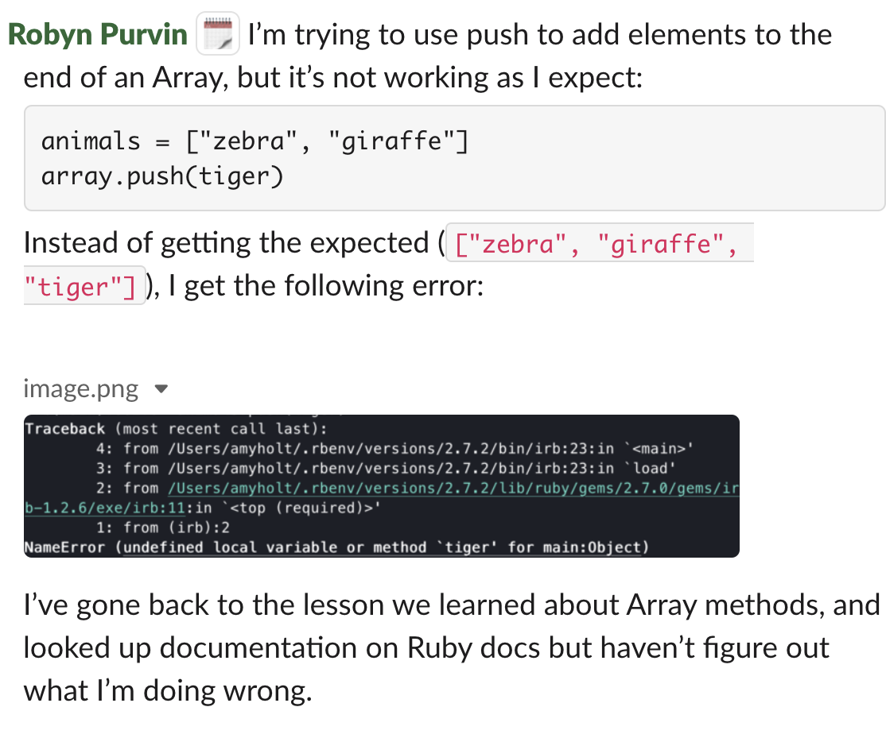
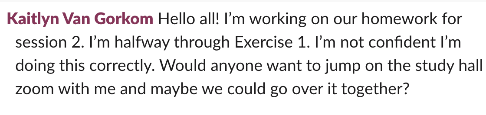
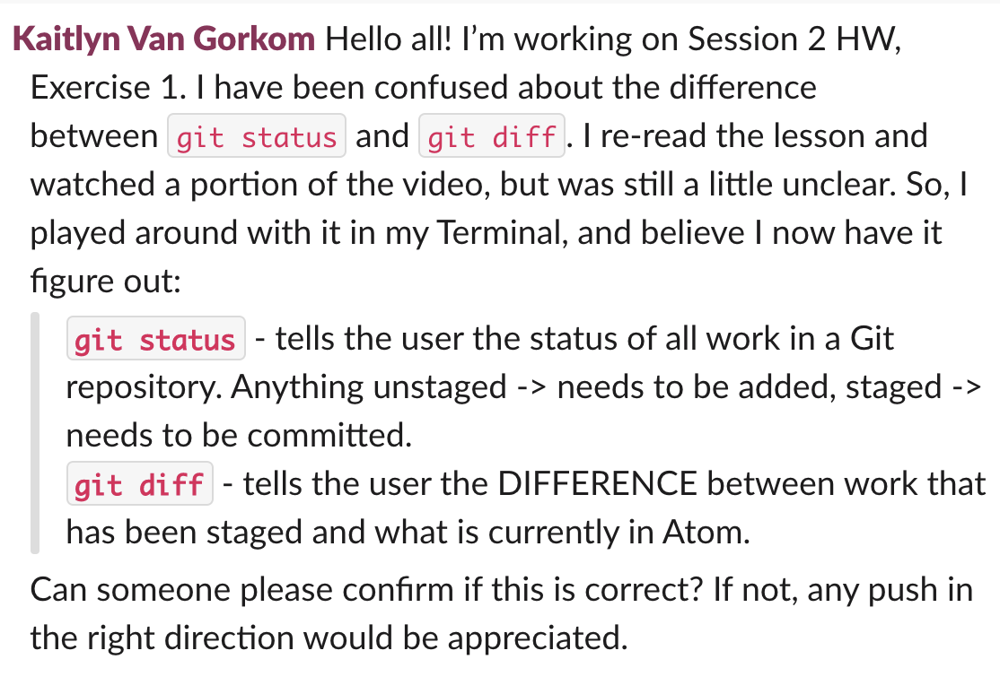

Asking technical questions may seem so easy when one is a beginner "I know so little, how could I NOT have questions?" However, effectively asking questions is a skill. This skill will be essential in your success - not just at Turing, but on the job hunt and on the job. How a developer asks questions communications a lot about their overall effectiveness. During your time at Turing, you will continue to hone this skill.

## Best Practices

Information to include in every question:
1. What were you trying to do?
1. What were you expecting to happen?
1. What happened instead?
1. What have you attempted/read to find a solution? 

Your goal is probably to get an answer ASAP, and a secondary goal should be to document this issue/challenge to help someone who may encounter the same thing in the future. Formatting your question well supports both of these goals. Some things to consider:
- Code snippets should not be formatted as plain text. Very short snippets could be formatted as `inline code` and longer snippets should be formatted in...
```
code blocks
```
- Screenshots of Terminal output are usually helpful (if Terminal output is relevant)
- A wall of text isn't something most people want to read. If you have a lot of context to provide, give a TL;DR in the main channel, then thread your details in manageable chunks. Another strategy is to use bold text and/or emojis strategically to highlight key information or questions.

## Examples and Non-Examples

<div class="s-card">
  <h3>Robyn & Arrays</h3>
  <p>The question that follows, from Robyn, isn't specific and puts a lot of work on the people potentially answer the question, rather than Robyn, the learner. Not only will people not completely know how to answer this, the answers probably won't help Robyn's learning much. If an employer saw a question like this from Robyn, they'd learn that she isn't resourceful and doesn't communicate her needs well; therefore will likely be a very expensive employee and one that doesn't contribute much.</p>
  <blockquote>
    
  </blockquote>
  <p>After she received some feedback, Robyn re-wrote her question. She provided a code snippet, shared the error message in her Terminal, and told the group what she'd tried. This question is quite easy to someone to read and answer quickly, demonstrating she is an effective communicator in a technical environment.</p>
  <blockquote>
    
  </blockquote>
</div>
<br>

<div class="s-card">
  <h3>Kaitlyn & Homework Help</h3>
  <p>Kaitlyn's inital question for homework help puts a big demand on the reader, and probably doesn't set her up to learn a lot. Most companies prefer asynchronous communication until live communication is necessary; seeing that Kaitlyn isn't communicating a clear question in writing could be a flag that she won't work independently.</p>
  <blockquote>
    
  </blockquote>  
    <p>After she didn't get any responses, Kaitlyn DMed her instructor, who gave her some feedback about why she likely didn't get responses. She re-wrote a her post to make a specific ask, demonstrating she did her due diligence to learn a concept but wanted to confirm her understanding. This type of message demonstrates that Kaitlyn can problem-solve, and communicate her needs for technical support.</p>
  <blockquote>
    
  </blockquote>
</div>

## Asking Questions

As you prepare to ask questions - in written form or in live communications - **think about how you can best present the necessary information to get your question answered and to demonstrate that your are an effective communicator in a technical environment.** Things to be prepared for, and ok with:
- It's not always easy to write up a question. It might take several minutes to find the words to describe the scenario - that's ok. Part of the job as a developer is asking questions, so it's ok to take time on it. Budget this into your time estimates for projects and work.
- This usually prompts what we call "rubber ducking" - or talking through the probelm to yourself or an inanimate object. Many times, the act of talking or writing through the components of a good question will help us answer our own question. In that case - it's definitely something to celebrate, and not a waste of time. If you didn't answer the question yourself and still need to ask, that's ok too!

## Check For Understanding

You won't submit anything in the submission form for this topic; but you will be asked to ask at least 1 question in your Slack small group daily. And, you'll be asked to reflect on questions (asked by you and peers) in some of your Daily Synthesis prompts. So, keep this in mind - come back to this document when you go to Slack to type of a question or keep a sticky note on your desk with the 4 best practices - whatever it takes to build a strong habit for yourself!

<br>
<br>
<br>