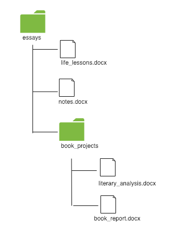

## Learning Goals

- Explain the purpose of Git
- Initialize, add, and commit changes in a local repository

## Git

<span class="vocab">Git</span> is a Version Control System (VCS). It allows you to save work on your project, and reference previous states of a project if needed. Normally when we save something on our computer, the newer version overwrites the older version. This is problematic if we need to look back at an earlier version. Git solves this problem by providing you multiple save points. You can get the current version, and ANY previous version. Git’s philosophy: never lose anything. Git works similarly to the way that Google Docs tracks changes over time.

### Why Use Git?

There are numerous reasons to use Git. Among them:

- The ability to "go back in time" to previous versions of your code if you break something
- The ability to "go back in time" to previous versions of your code if you change your mind about a feature
- The ability to chunk parts of your work so that you can choose from chunks to keep at a later time
- The ability to work collaboratively on the same project (even the same files!)
- The ability to track who made specific changes to specific files

In this section on Git, we'll learn these commands:

**Action Commands:**
<ul>
  <li><a href="#init" title="">git init</a></li>
  <li><a href="#add" title="">git add</a></li>
  <li><a href="#commit" title="">git commit</a></li>
</ul>

**Safe/Informative Commands:**
<ul>
  <li><a href="#status" title="">git status</a></li>
  <li><a href="#diff" title="">git diff</a></li>
</ul>

<div class="things-to-note">
  <h3>Things to Note</h3>
  <p>Git has a steep learning curve, and it can be confusing at the beginning. This lesson is not meant to make you a Git expert, but it will expose you to the basic Git commands and workflow. Most likely, you will not have the commands or workflow memorized after this.</p>
  <p>To get comfortable with Git (just like with anything else), you will need to put in hours of practice. It's an excellent idea to go back over this lesson multiple times.</p>
</div>

## Git Workflow

Watch the video and read the written explanation that follows in whatever order feels best to you. 

- [This video walks through the Git workflow](https://turingschool.zoom.us/rec/share/a71Rha9NKRwr0ISbvmkyA5AJeGq1ApTTtRGOfO_2g54u4UkgebKgeW3tn8xWYqIn.b8m5PxiNpLVCTwmz?startTime=1642875198000)
- A written explanation with 5 steps follows. (The example that is used throughout the written explanations that follow use a directory called `notes` with a file inside called `things_to_remember.md`.)
<br>

### 1. Start Tracking a Directory With Git (<span class="vocab">git init</span>)

By default, your changes will not be tracked. In order to tell git that we want to start tracking something, we need to initialize git in a directory.

```
timo@Tims-MacBook-Pro:~/notes$ git init
Initialized empty Git repository in /Users/timo/notes/.git/
```

This means Git now **HAS THE ABILITY** to track changes in the `notes` directory. This does **not** mean that Git _is_ tracking anything yet. Git is now prepared to track activity in the `notes` directory

*NOTE*: If you don't see this message when you run `git init`, it means you have not set up Git on your computer.

<div class="things-to-note">
  <h4>Things to Note</h4>
  <div class="flex-container">
    <div>
      
    </div>
    <div>
      <p>1. You only need to initialize a directory <strong>once</strong> in order to track everything else inside of it. </p>
      <p>For example, if I typed this while in the essays directory:</p>
      <pre>timo@Tims-MacBook-Pro:~/essays$ git init</pre>
      <p>Then every file inside that directory, regardless of how deeply nested, would be available for Git tracking.</p>
      <p><strong>Do not run the <code>git init</code> command more than once in the same directory or in child directories of the directory you initially ran it from. It will never be the answer to the problem you are facing.</strong></p>
      <p>2. Empty directories are <strong>not</strong> tracked by Git. Therefore, if you create a directory but there's nothing inside of it, git will ignore it. Git will only track it when there is a file inside of the directory.</p>
    </div>
  </div>
  <br>
  <p>3. What happens if you accidentally initialize Git in a directory where you didn't intend?</p>
  <p>When you run <code>git init</code>, a directory called <code>.git</code> is created inside of that folder. You can't see this folder using the <code>ls</code> command since it's a hidden folder. Everything that starts with "." is hidden. Instead, you can run <code>ls -a</code> which will display all hidden and visible files and directories.</p>
  <p>In a Git initialized directory, you'll see a <code>.git</code> directory. To remove git tracking, you would run:</p>
  <code>rm -rf .git</code>
  <p>This removes the Git directory, and you are no longer using Git to track your project. If you accidentally run <code>git init</code> in your home directory, and start tracking most of the files and directories on your entire computer, then remember to run <code>rm -rf .git</code> from your home directory. One way to tell if you've accidentally initialized Git in your home directory is to first go home by running:<code>cd ~</code> and then run: <code>git status</code>. If you see files being tracked but not staged for commit, then you need to remove the .git folder as layed out above. However, if your Terminal outputs:<code>fatal: Not a git repository (or any of the parent directories): .git</code>, then you are all good.</p>
</div>

### 2. Check the Status (<span class="vocab">git status</span>)

When you want to see what Git is tracking and the current status of files, you can use `git status`:

```
timo@Tims-MacBook-Pro:~/notes$ git status
On branch main

No commits yet

Untracked files:
  (use "git add <file>..." to include in what will be committed)

  things_to_remember.md

nothing added to commit but untracked files present (use "git add" to track)
```

`No commits yet` means that we haven't asked Git to save a version yet. You can think of a <span class="vocab">commit</span> as a snapshot of your work at a certain point in time. In the Google Doc, each save point was a commit. So far, we have no commits for our `notes` project.

`Untracked files` refers to the fact that even though we initialized a Git repository, we haven't started tracking anything yet. It lists the files that are available to track. (Also note "untracked files present" near the bottom).

<div class="things-to-note">
  <h4>Things to Note</h4>
  <p>You can run <code>git status</code> as many times as you want, whenever, wherever. It it a safe command that will not change anything about your tracking.</p>
</div>

### 3. Add a File to Track (<span class="vocab">git add &lt;filename&gt;</span>)

Let's add one of the files that we want to track to the <span class="vocab">staging area</span>. Google's dictionary defines "staging area" as "a stopping place or assembly point en route to a destination". If you've ever run a race, you know that the staging area is the place where all of the runners gather before the race begins. It's a place to make sure everything is good to go before continuing on.

We will add our file to the staging area.

```
timo@Tims-MacBook-Pro:~/notes$ git add things_to_remember.md
timo@Tims-MacBook-Pro:~/notes$ git status
On branch main

No commits yet

Changes to be committed:
  (use "git rm --cached <file>..." to unstage)

  new file:   things_to_remember.md

```

Notice the "changes to be committed" section: It tells us that we have a new file, `things_to_remember.md`, that is ready to be committed. We can say that the `things_to_remember.md` file is in the <span class="vocab">Git staging area</span>. That means no changes are tracked yet, but we're ready to take a snapshot of it (we'll do this next).

This may seem silly right now, given that we only have one file -- why not just commit the file? Why do we have to add it first? Let's take a [small detour](https://gist.github.com/rwarbelow/e1340ca3eeb616851a1a48221f48b67b).

### 4. Take a Snapshot in Time (<span class="vocab">git commit -m &lt;message&gt;</span>)

Now that our file is in the staging area, let's tell Git that we're ready to commit (take a snapshot of this moment to save). It's good practice to use "Initial commit" for your very first commit in each repository.

```
timo@Tims-MacBook-Pro:~/notes$ git commit -m 'Initial commit'
[main (root-commit) b7654a6] Initial commit
 1 file changed, 1 insertion(+)
 create mode 100644 things_to_remember.md
```

Now if I check the status, this is the output I see:

```
timo@Tims-MacBook-Pro:~/notes$ git status
On branch main
nothing to commit, working tree clean
```

### 5. Making File Changes, Adding New Commits, and Viewing Those Changes By Using (<span class="vocab">git diff &lt;filename&gt;</span>)
Now that we have our initial commit (or snapshot in time), let's make a change to one of our files.

We'll open up Atom to make these changes - Do you have auto-save enabled?

Your working directory now has changes that differ from what our file looked like the last time we committed (or took a snapshot).

```
timo@Tims-MacBook-Pro:~/notes$ git diff things_to_remember.md
diff --git a/things_to_remember.md b/things_to_remember.md
index e69de29..9ffd068 100644
--- a/things_to_remember.md
+++ b/things_to_remember.md
@@ -0,0 +1,2 @@
+Be kind
+Work hard
```

Then add your changes and commit them using an imperative verb that starts with a capital letter and a short commit message explaining what you did.

<br>

**The basic Git workflow is as follows:**

1. Make file changes in Atom
1. Check the `git status` to see what files are unstaged
1. Check the `git diff <filename>` to see what changes have happened since the last commit
1. `git add <whatever file you want to stage>`
1. Check the `git status` to make sure the correct files are in the staging area
1. `git commit -m "Message about your changes"` to commit the changes

<a name="gitbreakout"></a>
<div class="try-it">
  <h3>Try It</h3>
  <ol>
    <li>Navigate to your home directory</li>
    <li>Create a new directory called <code>to_do</code>. Inside of that directory, create a file called <code>tasks.md</code>.</li>
    <li>Initialize Git inside of the <code>to_do</code> directory so that we have Git available to track changes.</li>
    <li>Before you check the status, predict what it will say. Then, check the current status.</li>
    <li>Add <code>tasks.md</code> to the staging area.</li>
    <li>Make your first commit in this directory.</li>
    <li>Before you check the status, predict what it will say. Then, check the current status.</li>
    <li>Use Atom to add three separate tasks to <code>tasks.md</code>.</li>
    <li>Before you check the status, predict what it will say. Then, check the current status.</li>
    <li>Before you check the difference between your last commit and what the file looks like now, predict what it will say. Then, check the diff.</li>
    <li>Add the changes to the staging area.</li>
    <li>Before you check the status, predict what it will say. Then, check the current status.</li>
    <li>Commit the changes using a properly formatted commit message.</li>
    <li>Before you check the status, predict what it will say. Then, check the current status.</li>
  </ol>
</div>

<br>

## Readings

- Read this [article on git commit messages](https://chris.beams.io/posts/git-commit/)staging area
- [What's the use of the staging area in Git?](https://stackoverflow.com/questions/49228209/whats-the-use-of-the-staging-area-in-git) on Stackoverflow

## Check For Understanding

[Follow the directions in this Gist](https://gist.github.com/ameseee/e9ccdf8fae906a3bd1a3d5e81731413b) and submit your fork of it in the Google Form.

<br><br>